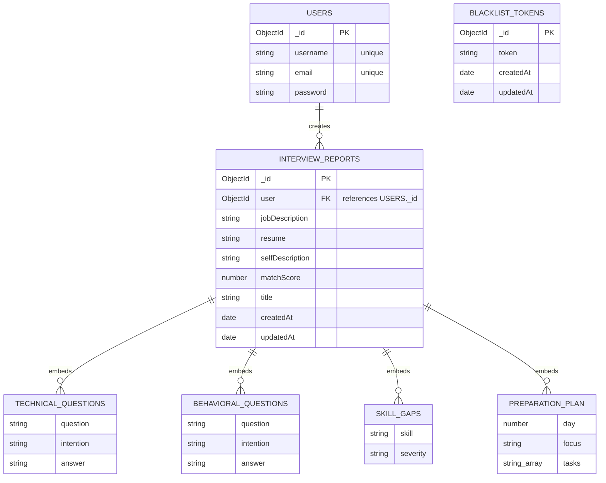

# AI Mock Interview & Preparation Platform

An AI-powered preparation platform designed to help users prep for job interviews. By analyzing the user's resume, self-description, and target job description, the platform generates mock technical & behavioral questions, rates resume-job match scores, flags skill gaps, and prepares a tailored day-by-day learning roadmap.

---

## 🚀 Key Features

* **AI-Powered Mock Interviews:** Generates personalized technical and behavioral questions based on resume, self-description, and target job profile.
* **Smart Evaluation & Feedback:** Calculates matching scores, identifies skill gaps (labeled by severity: low/medium/high), and provides ideal model answers for practice.
* **Custom Learning Roadmaps:** Generates a daily step-by-step preparation calendar to target weak spots.
* **Secure Authentication:** JWT-based signup, login, and secure logout with token blacklisting.
* **Modern UI/UX:** Responsive styling built using Sass.

---

## 🛠️ Tech Stack

### Frontend
* **Core:** React 19, Vite
* **Routing:** React Router v7
* **Styling:** Sass (SCSS)
* **API Client:** Axios

### Backend
* **Runtime:** Node.js, Express v5
* **AI Model Engine:** Google GenAI SDK (`@google/genai`)
* **File Uploads/Parsing:** Multer & pdf-parse (for parsing resumes)
* **Authentication:** JSON Web Tokens (JWT), bcryptjs, Cookie Parser
* **Database ODM:** Mongoose (MongoDB)

### Database
* **Database:** MongoDB (Atlas Cloud)

---

## 📊 Database Architecture (ER Diagram)

Below is the entity-relationship representation of the MongoDB collections:



---

## 📁 Directory Structure

```text
interview-ai-yt-main/
├── Backend/
│   ├── src/
│   │   ├── config/          # DB connection configuration
│   │   ├── controllers/     # Controller logic (Auth, Interview)
│   │   ├── middlewares/     # Authentication & request filters
│   │   ├── models/          # Mongoose Schemas (User, Report, Blacklist)
│   │   ├── routes/          # Express route definitions
│   │   └── services/        # Third party APIs / AI services
│   ├── server.js            # Express app entrypoint
│   └── .env                 # Backend environment variables
└── Frontend/
    ├── src/
    │   ├── features/        # Component features (auth, interview contexts)
    │   ├── style/           # Scss styles
    │   ├── App.jsx          # Main App module
    │   └── app.routes.jsx   # Client-side routing configuration
    └── .env                 # Frontend environment variables
```

---

## ⚙️ Setup & Installation

### Prerequisites
* Node.js (v18+ recommended)
* MongoDB database (local or Atlas cluster)
* Google Gemini API Key

### 1. Setup Backend
1. Navigate to the `Backend` directory:
   ```bash
   cd Backend
   ```
2. Install dependencies:
   ```bash
   npm install
   ```
3. Create a `.env` file in the `Backend` directory and populate the variables:
   ```env
   PORT=5000
   MONGODB_URI=your_mongodb_connection_uri
   GOOGLE_GENAI_API_KEY=your_gemini_api_key
   JWT_SECRET=your_jwt_secret_key
   ```
4. Start the server in development mode:
   ```bash
   npm run dev
   ```

### 2. Setup Frontend
1. Navigate to the `Frontend` directory:
   ```bash
   cd ../Frontend
   ```
2. Install dependencies:
   ```bash
   npm install
   ```
3. Create a `.env` file in the `Frontend` directory:
   ```env
   VITE_API_BASE_URL=http://localhost:5000
   ```
4. Start the Vite development server:
   ```bash
   npm run dev
   ```

---

## 🤝 Contribution & License
Feel free to open issues and pull requests to improve the platform! 

Licensed under the ISC License.
